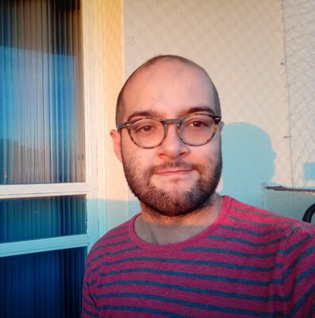
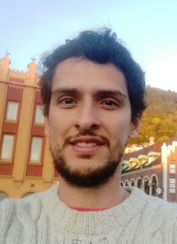
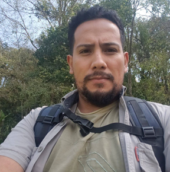
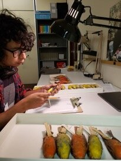
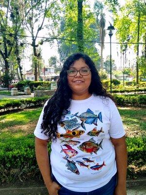
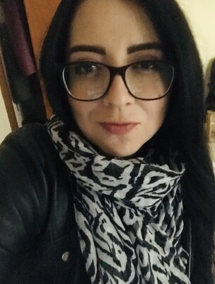
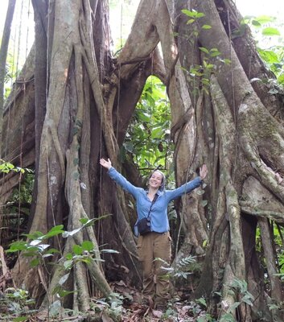

## Principal Investigators

::: {.team-grid}

::: {.team-card}
{.team-photo}

### Fabricio Villalobos
**Investigador Titular C, SNI III (Full Researcher)**  
Instituto de Ecología, A.C. (INECOL)  
*Interests:* Macroecology · Biogeography · Macroevolution · Conservation Biology

Interested in all things "macroecological", integrating ecology, biogeography and macroevolution to explain geographic biodiversity patterns.

[✉](mailto:fabricio.villalobos@inecol.mx) · [Google Scholar](https://scholar.google.com/citations?user=9CxnRG4AAAAJ) · [GitHub](https://github.com/fabro)
:::

::: {.team-card}
{.team-photo}

### Luis D. Verde Arregoitia
**Técnico Titular A, SNI I (Assistant Researcher)**  
Instituto de Ecología, A.C. (INECOL)  
*Interests:* Mammals · Ecomorphology · Macroecology · R programming · Data Science

Mammalogist and conservation scientist specializing in the ecology and evolution of small mammals.

[✉](mailto:luisd@ciencias.unam.mx) · [luisdva.github.io](https://luisdva.github.io/)
:::

:::

---

## Researchers

::: {.team-grid}

::: {.team-card}
{.team-photo}

### Gabriel Massaine Moulatlet
**Postdoctoral Researcher**  
Instituto de Ecología, A.C. (INECOL)  
*Interests:* Numerical Ecology · Macroecology · Diversity gradients · Environmental Impact Assessments

Biologist with broad interest in tropical ecology, with experience in Amazonian forests and the Andes.

[✉](mailto:mandprogabriel@gmail.com) · [gamamo.netlify.app](https://gamamo.netlify.app/)
:::

::: {.team-card}
{.team-photo}

### Carmen Galán Acedo
**Visiting Researcher**  
UNAM-Morelia  
*Interests:* Landscape ecology · Primatology · Spatial patterns

PhD in Biological Sciences from UNAM. Studies the effects of land-use change on biodiversity, particularly primates at regional and global scales.

[✉](mailto:cgalanac@gmail.com)
:::

::: {.team-card}
{.team-photo}

### Jessica Falcão
**Postdoctoral Researcher**  
Instituto de Ecología, A.C. (INECOL)  
*Interests:* Exotic plants · Invasion ecology · Insect-plant interaction

Studies the phylogenetic structure of exotic and native plant assemblages in Mexican montane cloud forests.

[✉](mailto:jecafalcao@gmail.com)
:::

:::

---

## Graduate Students

::: {.team-grid}

::: {.team-card}
{.team-photo}

### Alejandro Sánchez Barradas
**PhD Student**  
Instituto de Ecología, A.C. (INECOL)  
*Interests:* Biotic interactions · Carnivores · Macroecology

Studies how the number of potential prey species and body size ranges influence carnivorous mammal species richness.

[✉](mailto:alejandro.sanchez@posgrado.ecologia.edu.mx)
:::

::: {.team-card}
{.team-photo}

### Carlos Marín
**PhD Student**  
Instituto de Ecología, A.C. (INECOL)  
*Interests:* Lizards · Herpetology · Macroevolution · Systematics of Amphibians and Reptiles

Evolutionary biologist and herpetologist studying biodiversity gradients, with a focus on Neotropical lizard diversification.

[✉](mailto:carlos.marin@posgrado.ecologia.edu.mx)
:::

::: {.team-card}
{.team-photo}

### Daniel Valencia
**PhD Student**  
Instituto de Ecología, A.C. (INECOL)  
*Interests:* Freshwater fishes · Geographic ranges · Macroecology

Studies large-scale patterns of species distribution and richness, with a focus on Neotropical freshwater fishes.

[✉](mailto:daniel.valencia@posgrado.ecologia.edu.mx)
:::

::: {.team-card}
{.team-photo}

### Diana M. Ochoa-Sanz
**PhD Student**  
Instituto de Ecología, A.C. (INECOL)  
*Interests:* Bats · Trophic Ecology · Macroevolution

Her doctoral research focuses on dietary specialization and its relationship with rarity patterns in phyllostomid bats.

[✉](mailto:diana.ochoa@posgrado.ecologia.edu.mx)
:::

::: {.team-card}
{.team-photo}

### Gerardo Dirzo Uribe
**PhD Student**  
Instituto de Ecología, A.C. (INECOL)  
*Interests:* Bats · Mammals · Macroecology

Studies the relationship between Grinnellian and Eltonian niche breadth and richness patterns in phyllostomid bats.

[✉](mailto:gerardo.dirzo@posgrado.ecologia.edu.mx)
:::

::: {.team-card}
{.team-photo}

### Juliana Herrera Pérez
**PhD Student**  
Instituto de Ecología, A.C. (INECOL)  
*Interests:* Ichthyology · Macroecology · Macroevolution

Studies how morphological and ecological traits of freshwater fish species have influenced their diversification globally.

[✉](mailto:juliana.herrera@posgrado.ecologia.edu.mx)
:::

::: {.team-card}
{.team-photo}

### Kevin Lopez Reyes
**PhD Student**  
Facultad de Ciencias, UNAM (Yucatán)  
*Interests:* Herpetology · Ecological niche · Species richness gradients

Studies evolutionary, ecological and geographical drivers of species richness in Spiny Lizards (*Sceloporus*).

[✉](mailto:lopezreyes.ka@gmail.com)
:::

::: {.team-card}
{.team-photo}

### Martin Cabrera
**PhD Student**  
Instituto de Ecología, A.C. (INECOL)  
*Interests:* Mammals · Bats · Ecomorphology · Macroecology · Macroevolution

Studies the mode of evolution and rates of change of wing morphology and acoustic signals in bats at a global scale.

[✉](mailto:martin.cabrera@posgrado.ecologia.edu.mx)
:::

::: {.team-card}
{.team-photo}

### Roberto Ruiz
**PhD Student**  
Instituto de Ecología, A.C. (INECOL)  
*Interests:* Bats · Bioacoustics · Macroecology · Landscape Ecology · Science outreach

Studies knowledge gaps in bat functional traits and their effect on macroecological patterns and conservation.

[✉](mailto:roberto.ruiz@posgrado.ecologia.edu.mx)
:::

::: {.team-card}
{.team-photo}

### Monserrat Juárez
**MSc Student**  
Instituto de Ecología, A.C. (INECOL)  
*Interests:* Carnivores · Anthropogenic impact · Macroecology

Evaluates spatial patterns of carnivore diversity dimensions and the environmental and anthropogenic factors shaping them.

[✉](mailto:monserrat.juarez@posgrado.ecologia.edu.mx)
:::

:::

---

## Alumni

::: {.team-grid}

::: {.team-card}
{.team-photo}

### Egon Luis Vilela do Valle
**PhD Alumni** — Universidade Federal de Goiás, Brazil  
*Interests:* Macroecology · Evolution · Bats · Bioacoustics

Studied the role of evolution in geographic range size, climatic niche, and dispersal ability in the order Chiroptera.
:::

::: {.team-card}
{.team-photo}

### Juan D. Carvajal-Quintero
**PhD 2020** — Instituto de Ecología, A.C. (INECOL)  
*Interests:* Freshwater systems · Fishes · Macroecology

Currently a postdoctoral researcher at iDiv (Germany). His dissertation addressed drivers of geographic range size in freshwater fishes.

[✉](mailto:juanchocarvajal@gmail.com)
:::

::: {.team-card}
{.team-photo}

### Erick J. Corro
**PhD 2022** — Instituto de Ecología, A.C. (INECOL)  
*Interests:* Biotic interactions · Statistics · Spatial patterns

Currently a professor at Universidad Veracruzana, Córdoba campus.

[✉](mailto:erick.corro@posgrado.ecologia.edu.mx)
:::

::: {.team-card}
{.team-photo}

### Axel Arango
**PhD Alumni** — Instituto de Ecología, A.C. (INECOL)  
*Interests:* Biogeography · Birds · Macroevolution

Studied the effects of dispersal capabilities of New World Emberizoidea families on their diversification rates and patterns.

[✉](mailto:axel.arango@posgrado.ecologia.edu.mx)
:::

::: {.team-card}
{.team-photo}

### Ana Berenice García Andrade
**PhD Alumni** — Instituto de Ecología, A.C. (INECOL)  
*Interests:* Ichthyology · Poecilids · Macroecology · Macroevolution

Studied diversity patterns of the family Poeciliidae under a macroecological and macroevolutionary approach.

[✉](mailto:berenice.garcia@posgrado.ecologia.edu.mx)
:::

::: {.team-card}
{.team-photo}

### Citlalli Edith Esparza Estrada
**PhD Alumni** — Instituto de Ecología, A.C. (INECOL)  
*Interests:* Herpetology · Snakes · Biogeography · Macroecology

Studied macroecological and macroevolutionary patterns of viper distribution.

[✉](mailto:citlalli.edith@posgrado.ecologia.edu.mx)
:::

::: {.team-card}
{.team-photo}

### Laura Saldívar Burrola
**MSc Alumni** — Instituto de Ecología, A.C. (INECOL)  
*Interests:* Mammalogy · Landscape ecology · Macroecology

Investigated how two primate species (family Atelidae) respond to deforestation in tropical forests of southeastern Mexico.

[✉](mailto:laura.saldivar@posgrado.ecologia.edu.mx)
:::

:::
