::: {.hero-section}
::: {.section-block}

## Welcome to the Evolutionary Macroecology Lab

Our lab focuses on the intersection between macroecology and macroevolution, considering macroecological patterns under an evolutionary perspective and evolutionary patterns and processes in a spatial context. We are based at the <a href="https://www.inecol.mx/index.php/ciencia/redes-academicas/biologia-evolutiva">Evolutionary Biology Network</a> of <a href="https://www.inecol.mx/">Instituto de Ecología A.C. - INECOL, Mexico</a>. We are also part of the <a href="https://ecoevol.ufg.br/">Ecology & Evolution Graduate Program of the Universidade Federal de Goiás (UFG), Brazil</a>. We support the <a href="https://peeer.net">PEEER initiative for a #BetterPublishing system</a>.

:::
:::

::: {.parallax-container}
::: {.parallax-bg-1}
::: {.section-block .parallax-text}

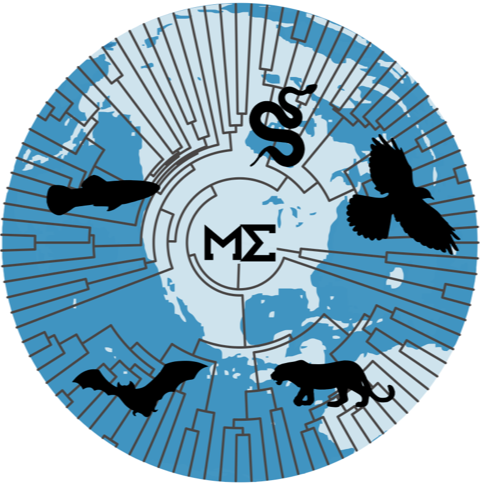

<a href="https://www.facebook.com/maevolabMX/" aria-label="Facebook"><i class="bi bi-facebook"></i></a>
<a href="https://github.com/fabro" aria-label="GitHub"><i class="bi bi-github"></i></a>

## Macroecology · Macroevolution · Biogeography

We integrate macroecological theory and methods with phylogenetic approaches to understand the geographic patterns of biodiversity and the causes that originate, maintain, and alter them.

:::
:::
:::

::: {.section-text}
::: {.section-block}

## Research

Our research interests span macroecology, macroevolution, biogeography, community ecology, ecophylogenetics, and conservation biology. We work primarily with vertebrates, but also with insects and plants.

- Macroecology
- Biogeography
- Macroevolution
- Conservation Biogeography
- Spatial Statistics
- Phylogenetic Comparative Methods

[View research →](investigacion.qmd){.btn .btn-outline-primary .mt-3}

:::
:::

::: {.section-text}
::: {.section-block}

## Projects

::: {.project-grid}

::: {.project-card}
### [(Evolutionary) Macroecology](proyecto-macroecologia.qmd)
Macroecological patterns under an evolutionary perspective, integrating ecology, biogeography, and phylogenetics.
[Read more →](proyecto-macroecologia.qmd){.btn .btn-sm .btn-outline-primary .mt-1}
:::

::: {.project-card}
### [Macroevolution](proyecto-macroevolucion.qmd)
Evolutionary processes of speciation, extinction, and dispersal shaping diversity at global scales.
[Read more →](proyecto-macroevolucion.qmd){.btn .btn-sm .btn-outline-primary .mt-1}
:::

::: {.project-card}
### [Conservation Biogeography](proyecto-consbiogeo.qmd)
Macroecological analyses applied to conservation planning and identification of knowledge gaps.
[Read more →](proyecto-consbiogeo.qmd){.btn .btn-sm .btn-outline-primary .mt-1}
:::

::: {.project-card}
### [Macroecology of Interactions](proyecto-interacciones.qmd)
Ecological networks and their variation across geographic and climatic gradients.
[Read more →](proyecto-interacciones.qmd){.btn .btn-sm .btn-outline-primary .mt-1}
:::

:::

[View all projects →](proyectos.qmd){.btn .btn-outline-primary .mt-2}

:::
:::

::: {.parallax-container}
::: {.parallax-bg-1}
::: {.section-block .parallax-text .parallax-text-left}

## Recent Publications

- [The latitudinal speciation gradient in freshwater fishes](https://doi.org/10.1371/journal.pone.0338966)  
  **Juliana Herrera-Pérez** et al. — *PLoS One* (2026)

- [Payment-based open access is biasing scientific participation from the Global South in ecology](https://doi.org/10.1002/oik.11867)  
  P. Y. Huais, **Fabricio Villalobos** et al. — *Oikos* (2026)

- [Advances in the Biogeography of Neotropical Mammals](https://doi.org/10.1007/978-3-031-43163-0_25-1)  
  **Luis D. Verde Arregoitia**, **Fabricio Villalobos** — *Mammals of Middle and South America. Springer* (2026)

- [Evolutionary Responses to Climate Change](https://doi.org/10.1016/B978-0-443-15750-9.00094-X)  
  **Fabricio Villalobos** et al. — *Encyclopedia of Evolutionary Biology, 2nd ed.* (2026)

- [Prevalence and patterns of convergent ecomorphological evolution in rodents](https://doi.org/10.1093/biolinnean/blaf122)  
  **Luis D. Verde Arregoitia**, **Fabricio Villalobos** et al. — *Biological Journal of the Linnean Society* (2025)

[View all publications →](publicaciones.qmd){.btn .btn-outline-light .mt-3}

:::
:::
:::

::: {.parallax-container}
::: {.parallax-bg-2}
::: {.section-block .parallax-text}

## Our Team

  
Principal Investigators

  
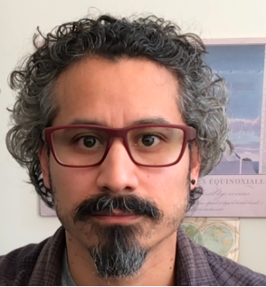Fabricio Villalobos

  
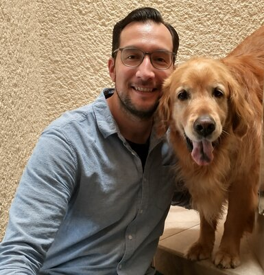Luis D. Verde Arregoitia

  
Researchers

  
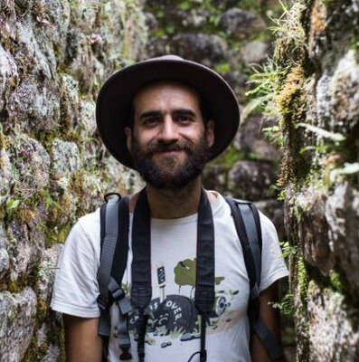Gabriel Moulatlet

  
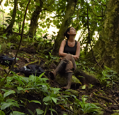Carmen Galán Acedo

  
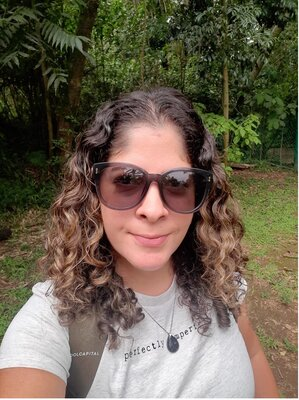Jessica Falcão

  
Graduate Students

  
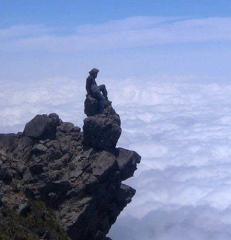Alejandro Sánchez

  
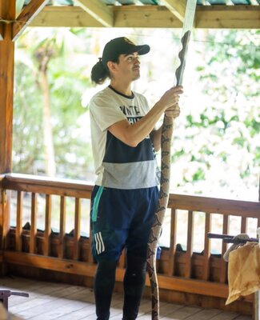Carlos Marín

  
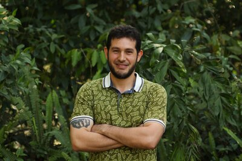Daniel Valencia

  
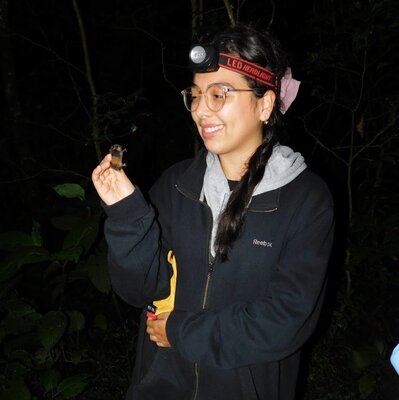Diana M. Ochoa-Sanz

  
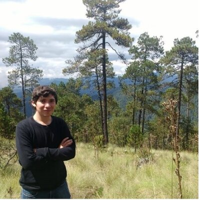Gerardo Dirzo

  
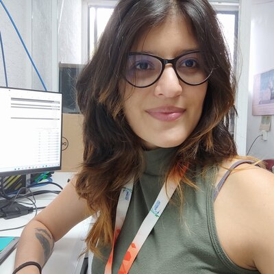Juliana Herrera

  
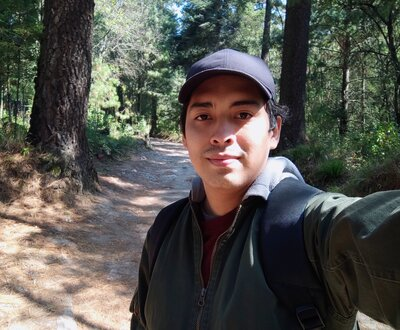Kevin López Reyes

  
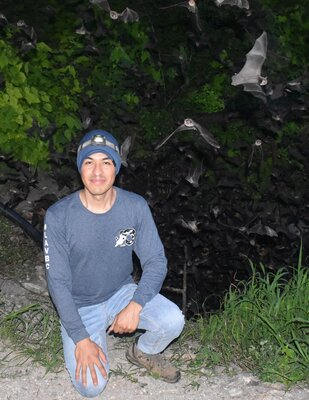Martin Cabrera

  
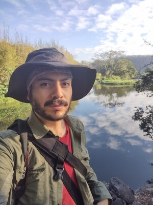Roberto Ruiz

  
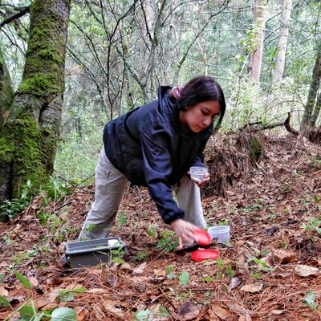Monserrat Juárez

[Meet the full team →](equipo.qmd){.btn .btn-outline-light .mt-2}

:::
:::
:::

::: {.section-text}
::: {.section-block .contact-block}

<i class="bi bi-geo-alt-fill"></i> Carretera Antigua a Coatepec 351, Xalapa, Veracruz 91073 Campus 1, Edificio C, Tercer Piso

<i class="bi bi-telephone-fill"></i> +52 228 8141800 ext. 3019 &amp; 3020

:::
:::
