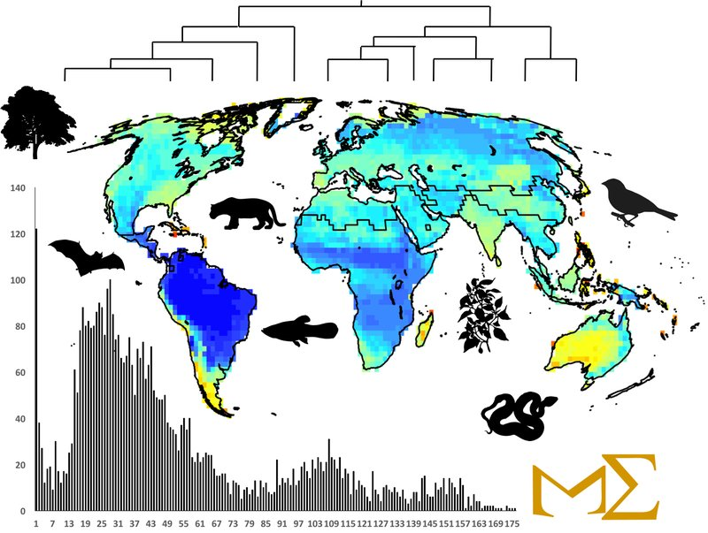
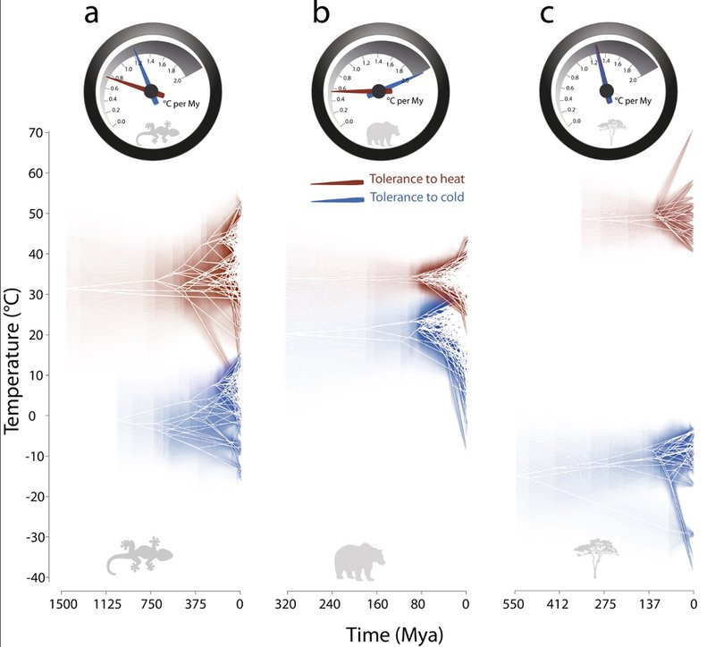
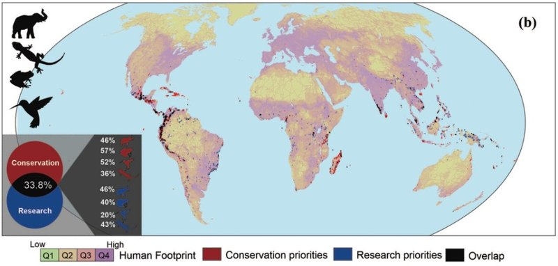
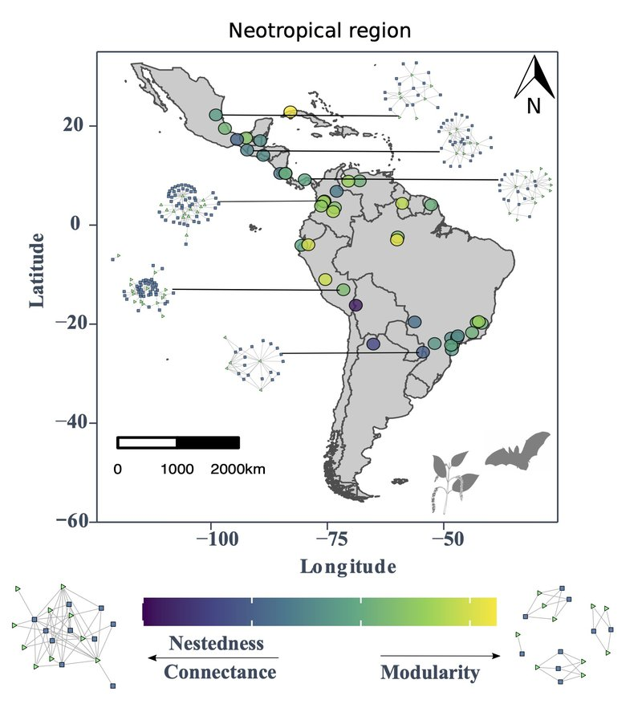

Our active research lines, integrating macroecology, macroevolution, biogeography, and conservation biology.

---

::: {.project-grid}

::: {.project-card}
{.project-img}

### [(Evolutionary) Macroecology](proyecto-macroecologia.qmd)

We study macroecological patterns under an evolutionary perspective, integrating ecology, biogeography, and phylogenetics to understand geographic biodiversity gradients and the drivers of species' geographic range sizes.

[Read more →](proyecto-macroecologia.qmd){.btn .btn-sm .btn-outline-primary}
:::

::: {.project-card}
{.project-img}

### [Macroevolution](proyecto-macroevolucion.qmd)

We investigate evolutionary processes of speciation, extinction, and dispersal that change species numbers across the planet, as well as the macroevolution of morphological and ecological traits.

[Read more →](proyecto-macroevolucion.qmd){.btn .btn-sm .btn-outline-primary}
:::

::: {.project-card}
{.project-img}

### [Conservation Biogeography](proyecto-consbiogeo.qmd)

We implement macroecological analyses in the context of conservation planning: priority site designation, knowledge gaps, biological invasions, and the effects of habitat loss and fragmentation on extinction risk.

[Read more →](proyecto-consbiogeo.qmd){.btn .btn-sm .btn-outline-primary}
:::

::: {.project-card}
{.project-img}

### [Macroecology of Interactions](proyecto-interacciones.qmd)

We combine macroecological and ecological network approaches to study how biotic interactions vary across geographic and climatic gradients at broad spatial scales.

[Read more →](proyecto-interacciones.qmd){.btn .btn-sm .btn-outline-primary}
:::

:::
